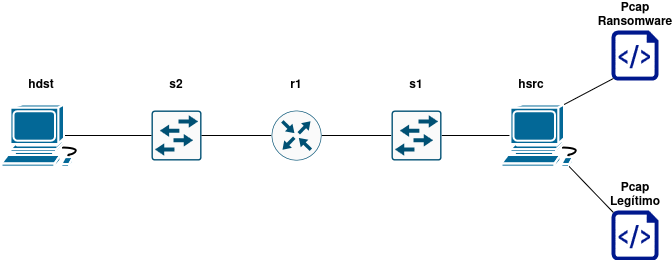

# Pruebas de Mininet

## Instalacion
Existen dos maneras para instalar Mininet, la primera es a través de su código fuente de github, para simplificar el proceso, he creado el script `instalacion.sh`. Este método por configuraciones propias de un script del propio mininet no funciona para todas las distribuciones de GNU/Linux.

La manera más fácil de instalar mininet es a través del gestor de paquetes:

```
sudo apt install mininet
sudo apt install openvswitch-switch
```

## Configuracion
La red de mininet te permite configurar un NAT por defecto, trabajando me he encontrado con una posible incompatibilidad entre docker y mininet pues sin motivo alguno y aparentemente a causa de docker, se añadía una regla a iptables que hacía DROP de todos los paquetes que vayan a la red de mininet desde el host es por eso que he creado el script `Configuracion.sh` que permite desactivar docker y eliminar esa regla si existe o activar docker para una vez finalizado el uso de mininet.

## Red Árbol 1
Para el primer árbol de decisión he seguido el siguiente diseño de red:



El plan era hacer pruebas con iperf entre el router y hdst para ver cuanto afectaba el filtro de árbol al rendimiento de la red, el problema, es que no todos los paquetes que se mandan son TCP o UDP, por lo que tendré que hacer otra clase de tests para que pueda medir también el rendimiento al enviar otra clase de paquetes como ICMP o IGMP.
